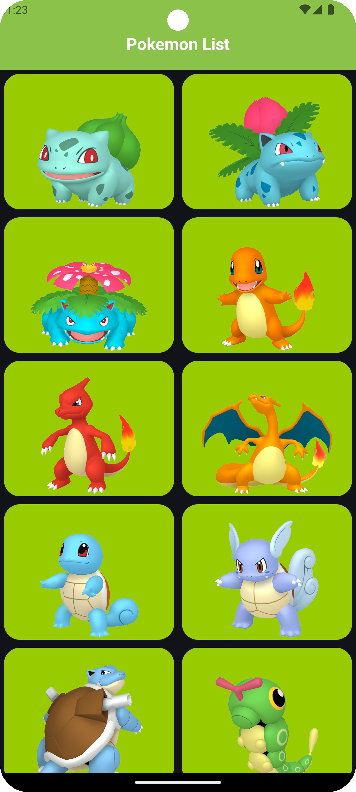
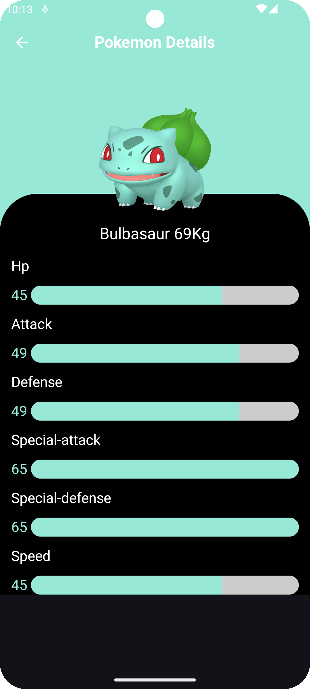
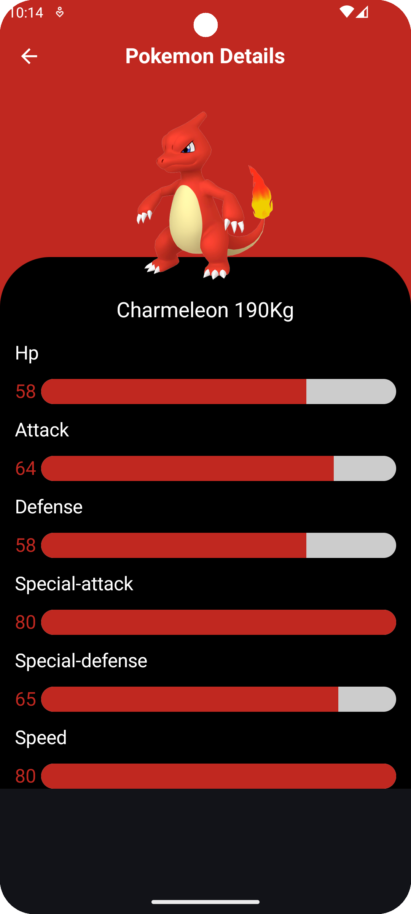

# Pokedex Compose Multi-Module
This Pokedex - Pokemon app is a project that contain and apply the latest Android technologies recommended by Google such as Multi Module Example Jetpack Compose, the new way to build the design.
Also, it contains some other important technologies such as Room Database, KSP, Hilt Dependencies Injection, the new Shared Element Transaction and new Navigation Type Safety.

# Examples

  
  
  
  

# The Project Contain the following technologies
Kotlin - https://kotlinlang.org/docs/getting-started.html  
Jetpack Compose https://developer.android.com/develop/ui/compose  
Jetpack Compose Navigation - New Shared Element Transition - https://developer.android.com/develop/ui/compose/animation/shared-elements - https://fvilarino.medium.com/shared-element-transitions-in-jetpack-compose-8f553078101e - https://getstream.io/blog/shared-element-compose/   
Retrofit for Network Manager https://square.github.io/retrofit/ - https://github.com/square/retrofit  
Room Database https://developer.android.com/training/data-storage/room  
Palette (Using the Pokemon Color to paint the Linear Indicator with the same color) - https://developer.android.com/develop/ui/views/graphics/palette-colors  
KSP - https://developer.android.com/build/migrate-to-ksp - https://github.com/google/ksp  
Coil For Compose - https://coil-kt.github.io/coil/compose/ - https://coil-kt.github.io/coil/ - https://github.com/coil-kt/coil  
Hilt Dependencies Injection - https://developer.android.com/training/dependency-injection/hilt-android  
New Navigation Type Safety - https://medium.com/androiddevelopers/navigation-compose-meet-type-safety-e081fb3cf2f8  

# Others
UI State  
View Model  
Repository  
Offline Support  
R8 enabled  

# Modules contain
## compose_ui (Features)
This module contain the two screens of the app, list of dynamic items and the details screen (this module is like a feature of the app - we can have many different features).
- List Screen
- Details Screen
- Generic Views
- Utils
## database (Core)
This module contain the database, model (handle the data). (Core Module)
- Room Database
- Models
- DI for Database
## navigation (Core)
This module contain the navigation between the screens.(Core Module)
- Screens Routes
- Navigation
## network (Core)
This module contain network manager from the remote, the service with apis and the repositories.(Core Module)
- Network Manager
- Services
- Repositories
- Utils
- DI for Network

# How to create a Module (Android Library) for an app from Android Studio
File -> New -> New Module -> Android Library -> Add your own Module Name -> Finish.

# Versioning
Target SDK version: 35  
Minimum SDK version: 28  
Kotlin version: 2.0.21  
Gradle version: 8.7.1  

# Feeds/Urls/End Point (parsing some data from the response)
## (Links References for Ends Points)
https://pokeapi.co/  
https://github.com/PokeAPI/sprites (GitHub)  